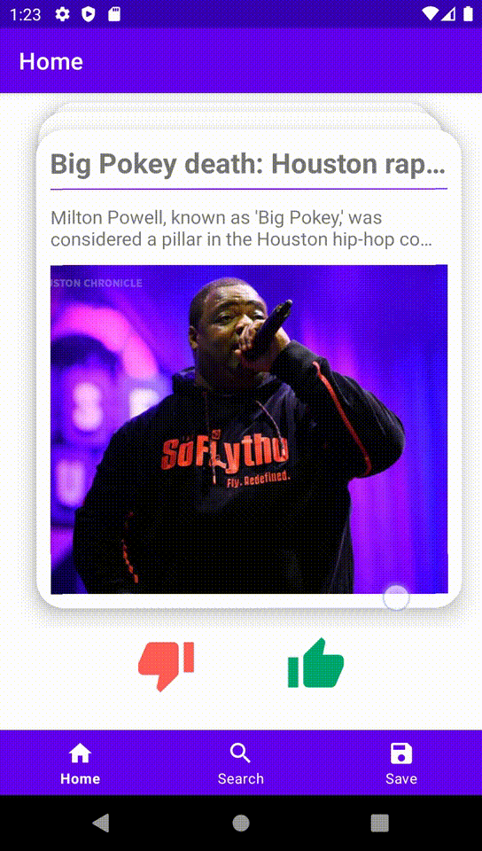

# FashionNews

An Instagram-style News Recommendation Andriod App

## App Demo

- Home fragment - click the like button or swipe the card right to save news. And click the dislike or swipe the card left to view the next one.
- Search fragment - use this one to search the keyword of news you like.
- Saved fragment - view the saved news detail at Save fragment. Click the delete button to remove it from local storage.

## MVVM

Model - View - ViewModel (MVVM) is the industry-recognized software architecture pattern that overcomes all drawbacks of MVP and MVC design patterns. MVVM suggests separating the data presentation logic(Views or UI) from the core business logic part of the application. The separate code layers of MVVM are:

- The View - is the collection of visible elements, which also receives user input. This includes user interfaces (UI), animations and text. The content of View is not interacted with directly to change what is presented.
- The ViewModel - is located between the View and Model layers. This is where the controls for interacting with View are housed, while binding is used to connect the UI elements in View to the controls in ViewModel.
- The DataModel - is responsible for the abstraction of the data sources. Model and ViewModel work together to get and save the data.

The architecture of this project is as follows:

## Retrofit

This project creates the network layer with Retrofit and its underlying OkHttp. The Retrofit are RESTful API setup on Android.
I use Gson to deserialize the model. Retrofit instantiates the interface into the actual implementation.

## NewsAPI

The source of the news is from [https://newsapi.org/](https://newsapi.org/). The RESTful APIs provide many different query parameters, this project mainly use two endpoints:
- https://newsapi.org/v2/everything
- https://newsapi.org/v2/top-headlines

## RecyclerView

A RecyclerView is used for displaying a large amount of data in the fashion of a list (single column) or a grid (multi-column).
The common RecyclerView case:

- A large collection of dynamic content, might be infinite.
- Each item in the collection is similar in structure.
- Limited memory space to hold all the data and their views.

A recycler view requires an Adapter and LayoutManager. An Adapter is for creating each item view and binding the data to a view by recycling.
A LayoutManager is for controlling how the views are organized, typically in a list or in a grid.

Here are the steps to implement a RecyclerView:
- Create the layout for item views.
- Create an adapter that contains the ViewHolder.
- Link the item_view layout to the ViewHolder and finish create/bind ViewHolder process in the recyclerView
- Pass the Adapter to the RecyclerView and setup the LayoutManager.

## Jetpack Navigation

Jetpack Navigation Component: [Navigation](https://developer.android.com/guide/navigation) and
[Documentation](https://developer.android.com/jetpack/androidx/releases/navigation). Single activity paradigm with multiple
fragments. Page navigation and app flow is controlled in one place, a navigation graph. The benefits are:
- Declarative visual screen flow and navigation all in one.
- Type safety with fragment safe args, it’s now been abstracted away.
- Great support for deeplinks with back stack handling.

The navigation graph of fragments are as follows:

## Room Database

Room is built on top of SQLite. It was introduced in 2018. Room has the following concepts:
- Database contains the database holder and serves as the main access point for the underlying connection to your app’s persisted, relational data.
- Entity represents a table within the database.
- DAO contains the methods used for accessing the database.

The advantage of Room:
- Sometimes apps doesn’t have network, like in tunnel or on plane.
- App need to support offline mode.
- App consume both network and local generated structure data.

 

Repository Integration: How does the database work with the rest of the MVVM architecture?

